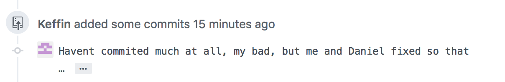
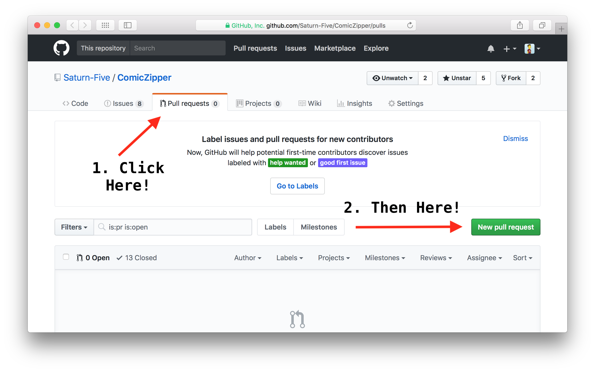
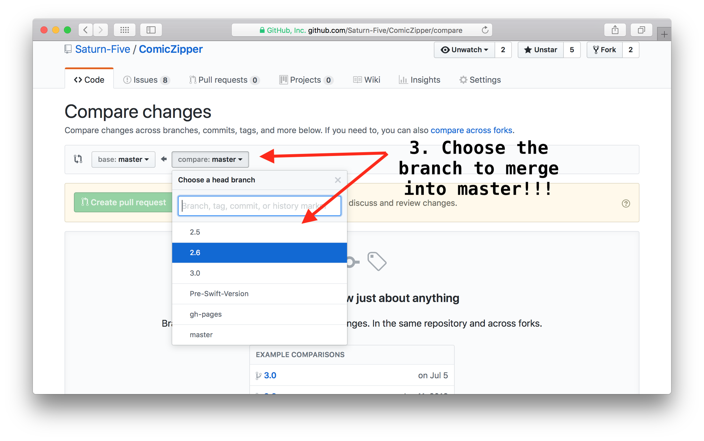
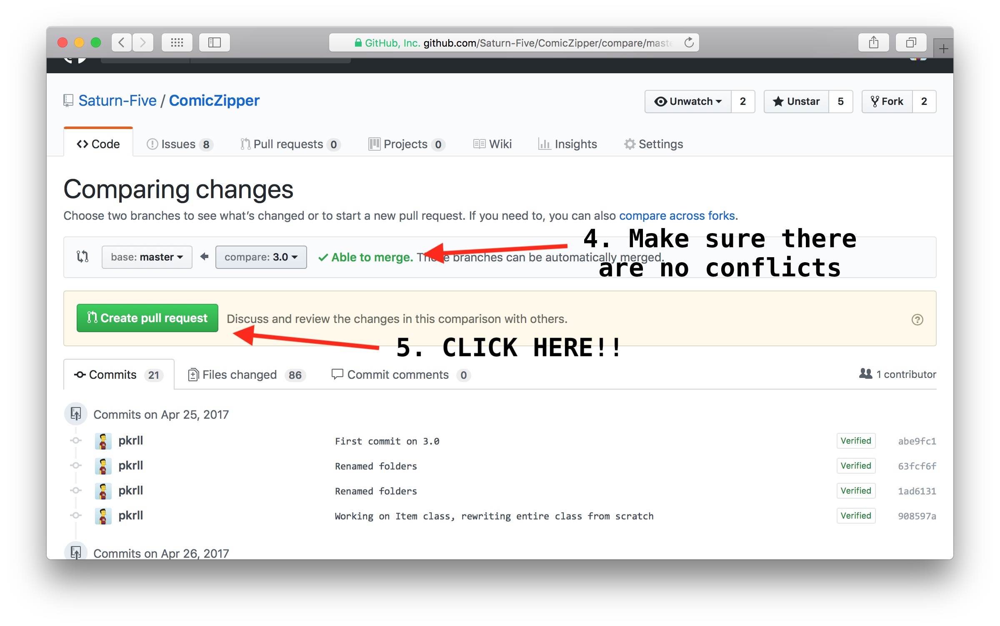
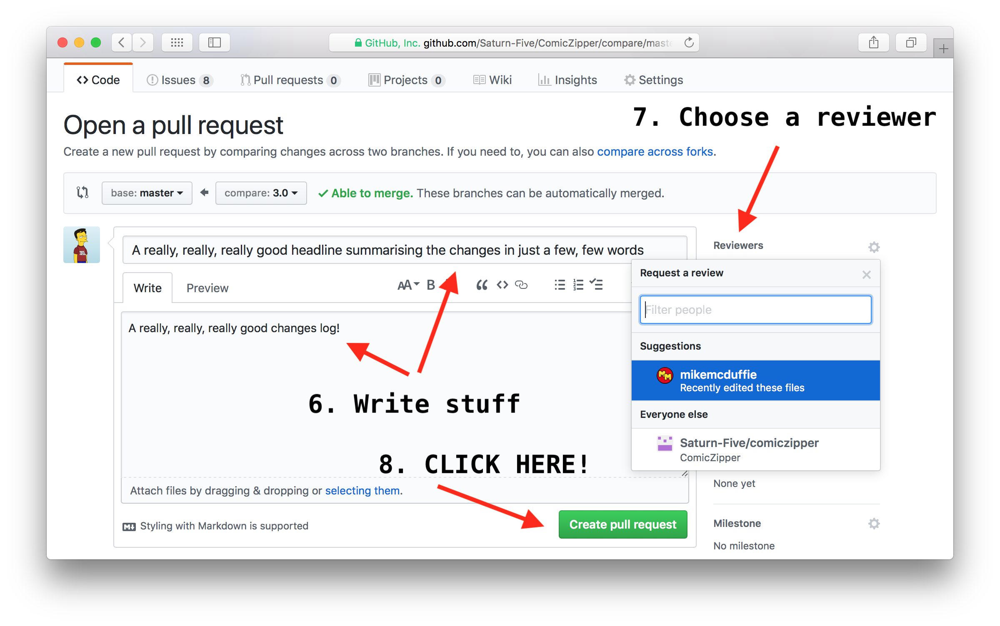

# Git Guidelines

*Author: Ardalan Samimi*<br>
*Version: 2.0.1*

## Table of Contents

1. [Introduction](#introduction)
2. [Start here](#start-here)
    1. [How do I do it?](#how-do-i-do-it)
3. [Branching](#branching)
    1. [Creating a new branch](#creating-a-new-branch)
    2. [Switching branches](#switching-branches)
    3. [Undoing changes](#undoing-changes)
    4. [Naming conventions](#naming-conventions)
        1. [Grouping tokens](#grouping-tokens)
4. [Commits](#commits)
    1. [Before committing](#before-committing)
    2. [When to commit](#when-to-commit)
        1. [How do I do it?](#how-do-i-do-it-1)
    4. [Commit messages](#commit-messages)
        1. [How do I do it?](#how-do-i-do-it-2)
5. [Push](#push)
    1. [How do I do it?](#how-do-i-do-it-3)
6. [Github features](#github-features)
    1. [Issues](#issues)
    2. [Pull requests](#pull-requests)
        1. [What to look at when reviewing?](#what-to-look-at-when-reviewing)
        2. [Who to choose as reviewer?](#who-to-choose-as-reviewer)
        3. [How do I do it?](#how-do-i-do-it-5)
7. [More information](#more-information)

## Introduction

This document outlines the workflow of the **IOTA OS PROJECT**, and how to contribute to this project. It includes a short guideline including some common best practices for Git/Github.

Feel free to contribute and suggest changes by using [branches](#branching) and [creating pull requests](#pull-requests).

Before you start typing a single line of code, please read this document from start to finish.

## Start here

Before every coding session – that is, before you sit down and make beautiful <s>love</s> code – make a habit of always pulling the latest changes from the remote repository.

This prevents you from working on outdated code. Obviously.

### How do I do it?

Fire up your favourite terminal app, cd to the project folder and just type the following command:

```bash
$ git pull
```

## Branching

A common dev pattern is to develop features isolated from each other in separate, local branches. This is sometimes referred to as the **Git feature branch workflow**.

This means that you should (almost) **never work directly on the** ``master`` **branch**, which should be protected and always include stable, working code.

Implementing new features, squashing bugs and other project related work must be done on a separate branch (see [naming conventions](#naming-conventions)), before merging the code back to the ``master`` branch when done.

### Creating a new branch

Creating a new branch is as easy as something else that's easy, by using the magical ``checkout`` command:

```bash
$ git checkout -b <branch_name>
```

This will create a new branch named ``<branch_name>``, and also switch to that branch directly. All in one command!

### Switching branches

Switching to another branch is even easier and can be done with the same ``checkout`` command:

```bash
$ git checkout <branch_name>
```

### Undoing changes

You can use the ``checkout`` command to undo changes in a specific file to restore them to their latest committed versions. Be warned though: **You will lose all your changes, so be cautious.**

```bash
$ git checkout <file_name>
```

To revert all changes in the working directory, you can replace ``<file_name>`` with a dot (``.``). Again, be warned: **You will lose all your changes, so be cautious.**

```bash
$ git checkout .
```

To revert a file back to its state in a specific commit, you can also add the commit id to the command:

```bash
$ git checkout <commit> <file_name>
```

### Naming conventions

So, you want to create a new branch? Great! But what to name it?

The following is a list of best practices stolen from the Internet:

* Use grouping tokens (words) at the beginning of the branch names ([see below](#grouping-tokens)).
* Define and use short lead tokens to differentiate branches in a way that is meaningful to your workflow.
* Use slashes to separate parts of your branch names, for instance ``some-branch-name``.
* Do not start with a number.
* Avoid long descriptive names for long-lived branches.

#### Grouping tokens

| Token | Description |
| :------------- | :------------- |
| ``dev``, ``feature`` | Implementation of new features |
| ``bug``, ``fix`` | Bug fixes or other issues |
| ``issue``, ``misc`` | Other [issues](#issues) that are not an implementation or a bug (optimisations, etc.) |
| ``refactor`` | Refactoring |
| ``test`` | Tests of different kinds |
| ``documentation`` | Documentation |

##### Example

```bash
$ git checkout -b feature/io-queue
$ git checkout -b bug/io-queue-segfault
$ git checkout -b issue/15
$ git checkout -b test/io-queue-test
$ git checkout -b documentation/git-guideline
```

## Commits

As we use Git and not, say, Subversion, you should **commit code early as well as often**.

It is **generally better to have more, but smaller commits**, rather than committing a large block of code (😩!!) at the end of the day.

Not only does this allow for your colleagues to follow the project better, it also makes it **easier to track bugs and roll back individual** changes if needed.

### Before committing

Before you commit your code, make sure to review and, if possible, test your code. **Never** (if not absolutely necessary) **commit code that is not done**.

### When to commit

A good rule of thumb is to make a new commit as soon as you can explain the change in a sentence.

Below is an attempt to formalize the above rule into some easy to follow rules (Stolen and adapted from [Git Best Practices: Workflow Guidelines](https://www.lullabot.com/articles/git-best-practices-workflow-guidelines)):

**Each commit should only include related changes**. For instance:

* if you've squashed a nasty bug, this should be an **individual commit**,

* you should **never add multiple classes, modules or files in the same commit**, unless there is tight coupling between these.

* when writing a new class or module, always **start with committing modules with only stub functions** and documentation first. **Commit after implementing each individual function**.

An individual commit should almost **never be more than 100 lines of code**.

#### How do I do it?

This can be done, for instance, by separating staging and committing, or committing the file before continuing to work on it.

Stage a file with the ``add`` command, before commiting:

```bash
$ git add modifiedFileOne
$ git add modifiedFileTwo
$ git commit -m "Some message"
```

### Commit messages



More important than when and what to commit, is the commit message.

Having good commit messages makes it easier for other people to understand your changes.

The message should begin with a short headline, summarising the changes, followed by a more detailed explanatory text separated by a blank line.

This model is stolen from the [Pro Git book](https://git-scm.com/book/en/v2) ([chapter 5.2](https://git-scm.com/book/en/v2/Distributed-Git-Contributing-to-a-Project)):

```
Short (50 chars or less) summary of changes

More detailed explanatory text, if necessary.  Wrap it to
about 72 characters or so.  In some contexts, the first
line is treated as the subject of an email and the rest of
the text as the body.  The blank line separating the
summary from the body is critical (unless you omit the body
entirely); tools like rebase can get confused if you run
the two together.

Further paragraphs come after blank lines.

  - Bullet points are okay, too

  - Typically a hyphen or asterisk is used for the bullet,
    preceded by a single space, with blank lines in
    between, but conventions vary here
```

#### How do I do it?

After staging the files, just use the ``commit`` command without the ``-m`` flag:

```bash
git commit
```

You can always change a commit message (if not pushed) by adding the ``--amend`` flag:

```bash
git commit --amend
```

### Push

Let's say you just hacked together <s>the most genius</s> a fine sorting algorithm for your music app. You've staged and committed the code. Now what? Well, it's not doing any good just sitting in your computer. You need to push it.

#### How do I do it?

After making one (or more) commit(s) just type the following:

```bash
$ git push
```

## Github features

Below follows some guidelines for Github specific features.

### Issues

Github's ``issue`` feature can be used in multiple ways. With the new ``projects board`` issues are an excellent way to incorporate the Kanban board / cards directly into the repository.

Use issues as you would cards on a Kanban board, that is, each issue should represent a task (for instance, a new feature or a bug report).

When creating ``issues``, be specific. Use a good, clear title and paste in (using the code or quote blocks) the buggy code or error message.

#### How do I do it?
Click on the "Issues" tab in the repository.

### Pull requests

When you're satisfied with your changes and want to incorporate those to the ``master`` branch, you should create a ``pull request`` on Github.

**IMPORTANT: Never merge a branch** before having someone else review the changes.

If a pull request contains changes that addresses an ``issue``, you can set that issue to automatically close when the pull request has been approved and merged. There are several keywords to use, for example ``close #issueNO``.

Put the line ``close #12`` in the PRs description, to close issue #12. The full list of keywords can [be found here](https://help.github.com/articles/closing-issues-using-keywords/).

#### What to look at when reviewing?

Use the following as a guide for when reviewing someone else's code (but also before creating a pull request). Granted, not all of these are always applicable.

* Is the code documented correctly?
* Are there any unit tests?
* Does the code run correctly on the target machine?
* Are there any parts in the code that
  * are not executed, or returns unused results?
  * can be abstracted or moved to some other logical units?
* Does the code follow our coding convention?
* Does the code apply lagom defensive programming?

#### Who to choose as reviewer?

* Not you!
* Someone not involved in the coding.
* Someone not already reviewing, or have reviewed your code multiple times previously.

#### How do I do it?
After pushing all your changes to the repository, do the following:






## More information

https://guides.github.com
